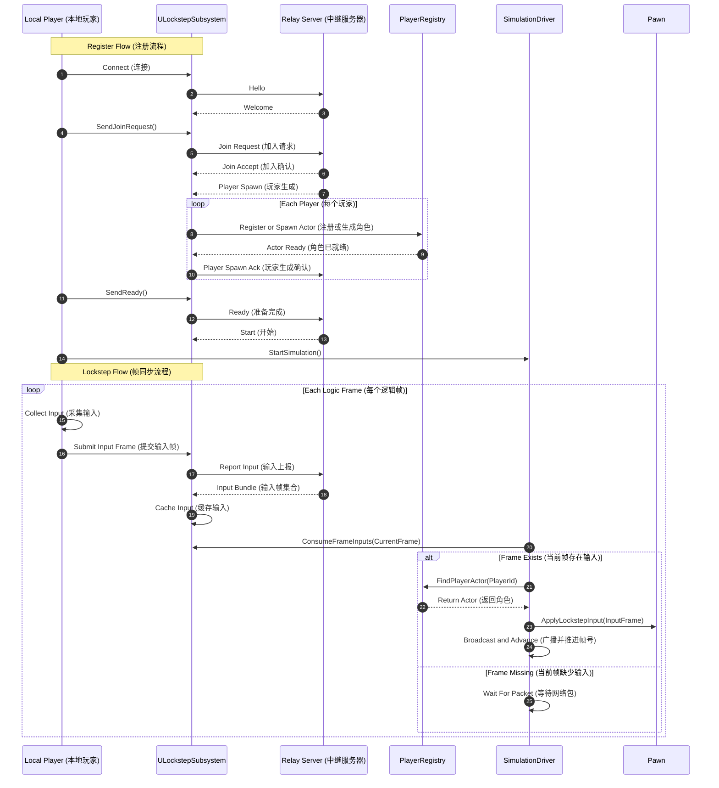

```mermaid
sequenceDiagram
    autonumber
    participant Local as Local Player (本地玩家)
    participant Client as ULockstepSubsystem
    participant Relay as Relay Server (中继服务器)
    participant Registry as PlayerRegistry
    participant Sim as SimulationDriver
    participant Pawn as Pawn

    Note over Local,Client: Register Flow (注册流程)
    Local->>Client: Connect (连接)
    Client->>Relay: Hello
    Relay-->>Client: Welcome

    Local->>Client: SendJoinRequest()
    Client->>Relay: Join Request (加入请求)
    Relay-->>Client: Join Accept (加入确认)

    Relay-->>Client: Player Spawn (玩家生成)
    loop Each Player (每个玩家)
        Client->>Registry: Register or Spawn Actor (注册或生成角色)
        Registry-->>Client: Actor Ready (角色已就绪)
        Client->>Relay: Player Spawn Ack (玩家生成确认)
    end

    Local->>Client: SendReady()
    Client->>Relay: Ready (准备完成)
    Relay-->>Client: Start (开始)

    Local->>Sim: StartSimulation()

    Note over Local,Client: Lockstep Flow (帧同步流程)
    loop Each Logic Frame (每个逻辑帧)
        Local->>Local: Collect Input (采集输入)
        Local->>Client: Submit Input Frame (提交输入帧)
        Client->>Relay: Report Input (输入上报)
        Relay-->>Client: Input Bundle (输入帧集合)
        Client->>Client: Cache Input (缓存输入)

        Sim->>Client: ConsumeFrameInputs(CurrentFrame)
        alt Frame Exists (当前帧存在输入)
            Sim->>Registry: FindPlayerActor(PlayerId)
            Registry-->>Sim: Return Actor (返回角色)
            Sim->>Pawn: ApplyLockstepInput(InputFrame)
            Sim->>Sim: Broadcast and Advance (广播并推进帧号)
        else Frame Missing (当前帧缺少输入)
            Sim->>Sim: Wait For Packet (等待网络包)
        end
    end
```