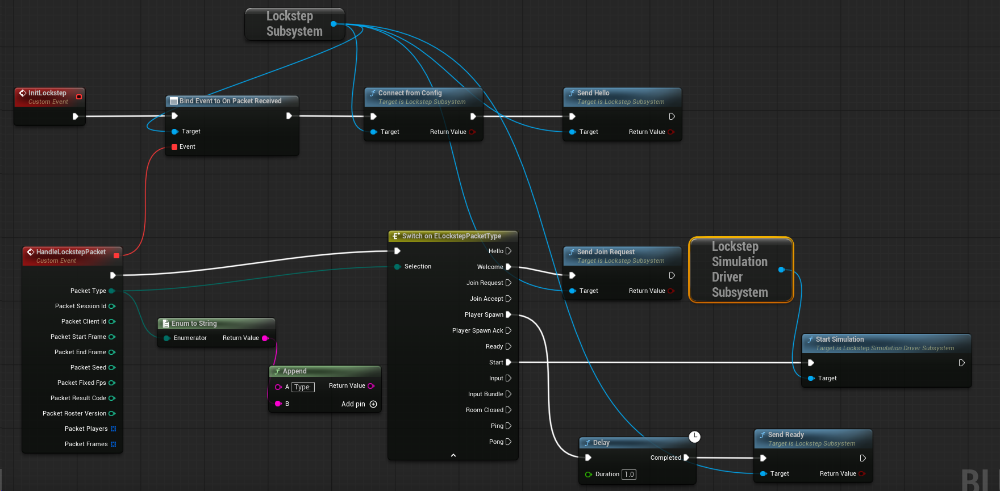
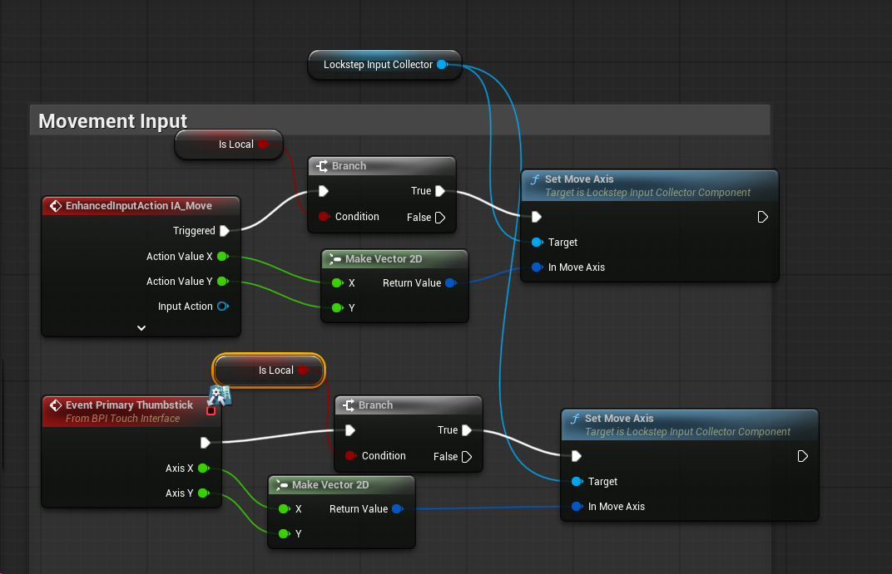
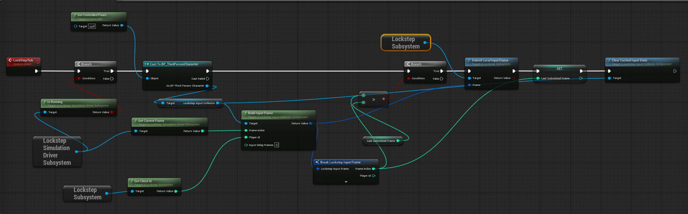
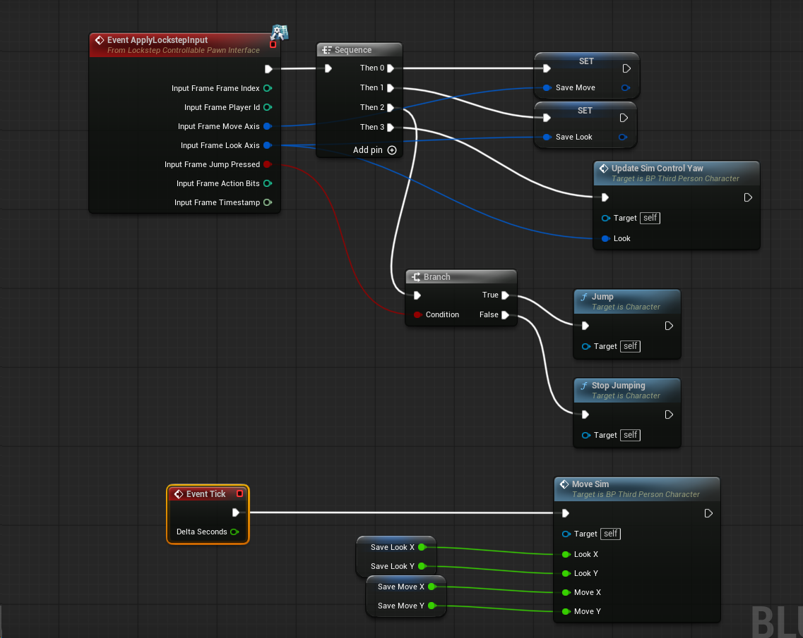
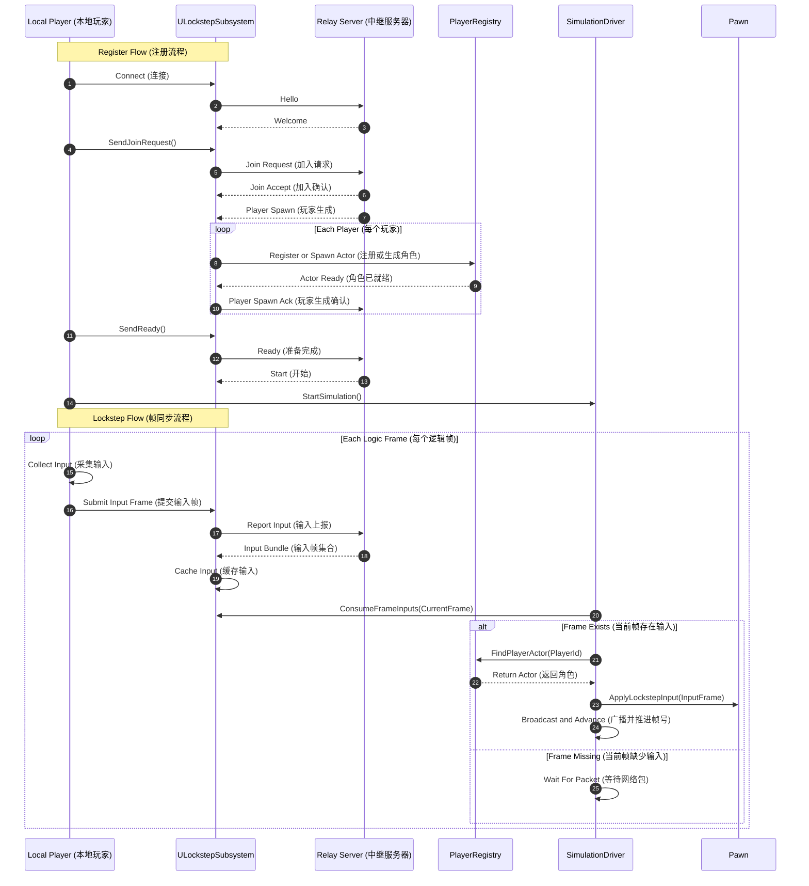

# LockStepThirdPerson

## 说明

- 当前实现是服务端汇总 `InputBundle` 后，客户端按固定步长消费，不走UE官方的Replication。

# Server代码说明

- Server代码路径: Tools/LockstepRelayServer/src/main.cpp
- `broadcastToJoined()` 给所有已加入房间的客户端广播，`canStartMatch()` 检查人数、`Ready` 状态和 `PlayerSpawnAck` 是否齐全，满足后才发送 `Start`。
- `buildPlayerSpawnPacket()` 组装当前 roster 的 `PlayerSpawn` 包；`JoinRequest` 分支里会分配 `playerId`、更新出生点并广播最新玩家列表。
- 帧输入汇总: `Input` 分支按 `frameIndex -> playerId` 聚合输入；当某帧收齐当前 roster 的全部玩家输入后，组装 `InputBundle` 广播给所有客户端。

# Client帧同步核心System

- [ULockstepSubsystem](/mnt/g/ue_proj/LockStepThirdPerson/Source/LockStepThirdPerson/Public/LockstepSubsystem.h#L16)
  客户端网络核心，负责连接 relay server、发送 `Hello` / `JoinRequest` / `Ready` / `Input`，接收服务器回包，并把 `InputBundle` 缓存到本地帧输入表中供仿真层消费。
- [ULockstepInputCollectorComponent](/mnt/g/ue_proj/LockStepThirdPerson/Source/LockStepThirdPerson/Public/LockstepInputCollectorComponent.h#L9)
  本地输入采集组件，负责缓存移动、视角、跳跃和动作位，并在需要发送时组装成 `FLockstepInputFrame`。
- [ULockstepSimulationDriverSubsystem](/mnt/g/ue_proj/LockStepThirdPerson/Source/LockStepThirdPerson/Public/LockstepSimulationDriverSubsystem.h#L13)
  固定步长仿真驱动，负责按逻辑帧推进同步；每次从 `ULockstepSubsystem` 取出当前帧输入，分发给对应 Pawn 执行，并广播 `OnSimTick`。

# 蓝图说明

- 注册流程: 在 `BP_ThirdPersonPlayerController`中的 `Event BeginPlay`
  
- 收集操作：在 `BP_ThirdPersonPlayer`中将输入事件收集
  
- 上报输入：在 `BP_ThirdPersonPlayerController`中将收集到的输入上报给 `ULockstepSubsystem`
  
- 消费输入：在 `BP_ThirdPersonPlayer`中将服务器下发的操作消费（包括本地玩家和同步玩家）
  

## 当前工程同步时序

